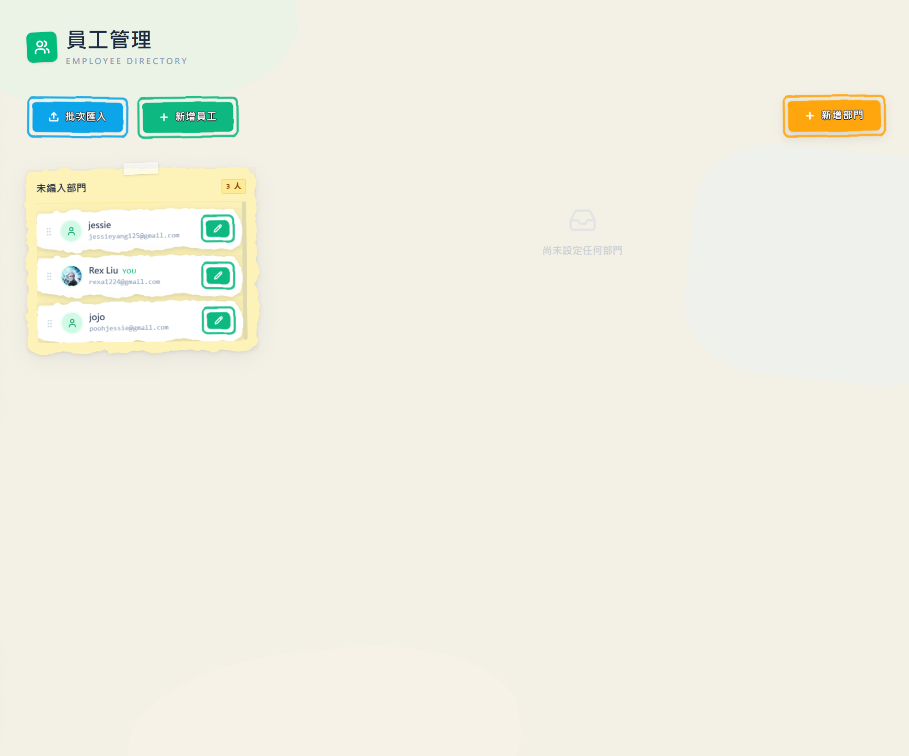
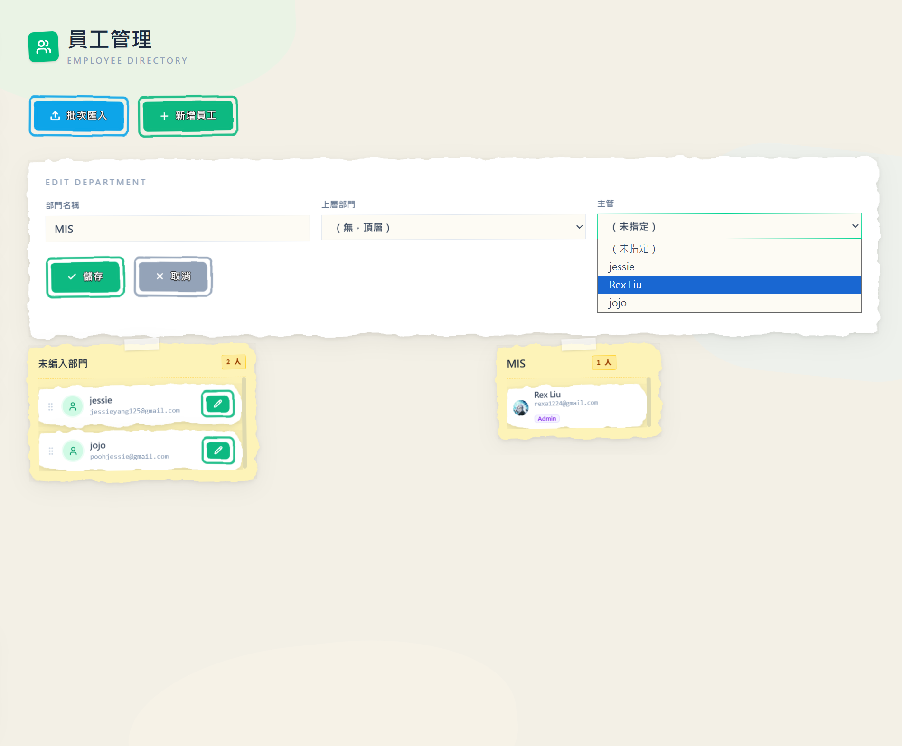
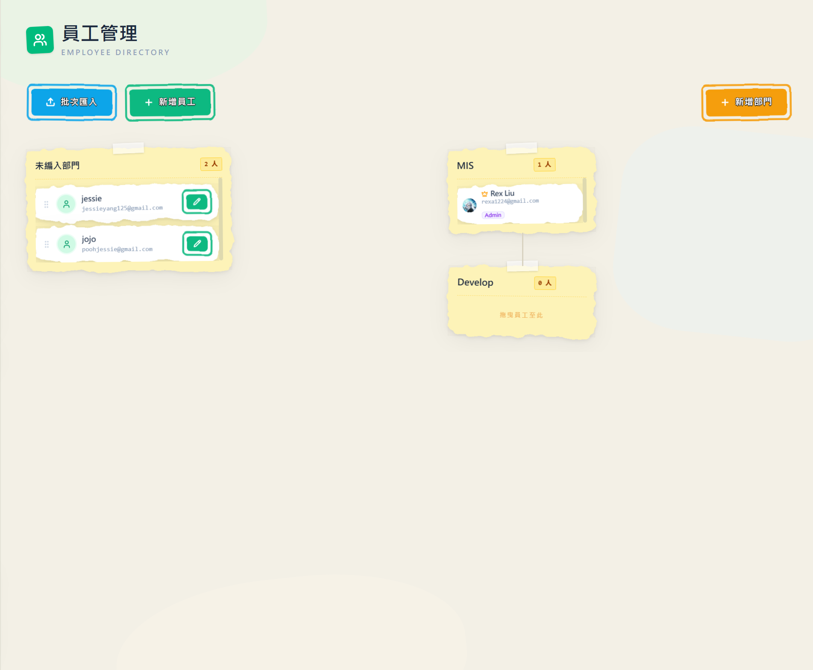
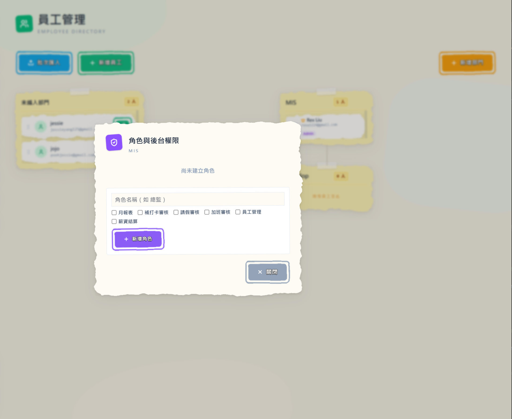
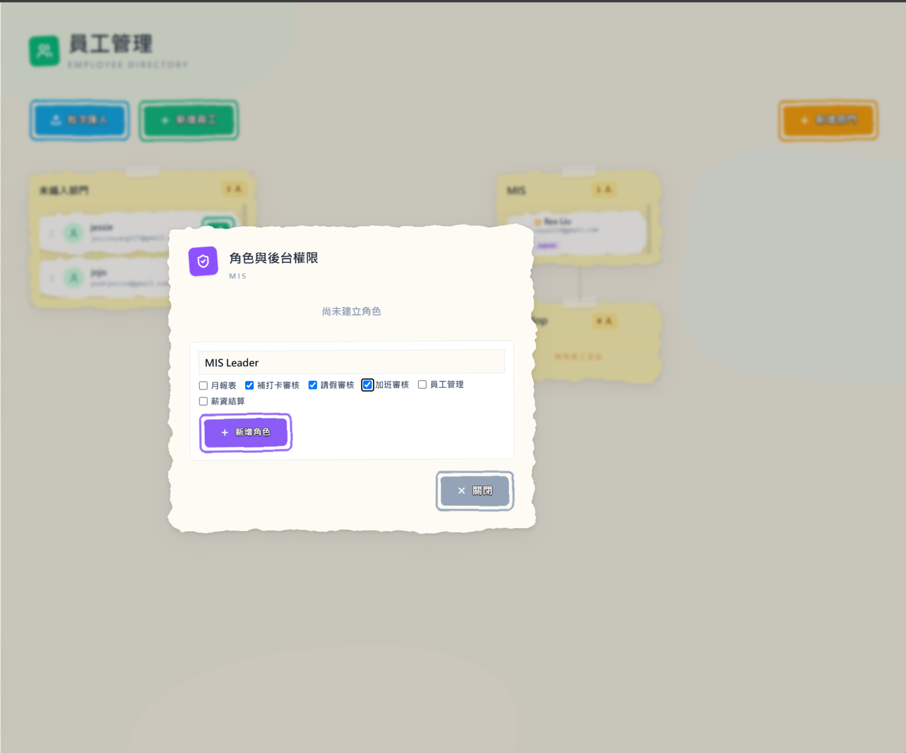
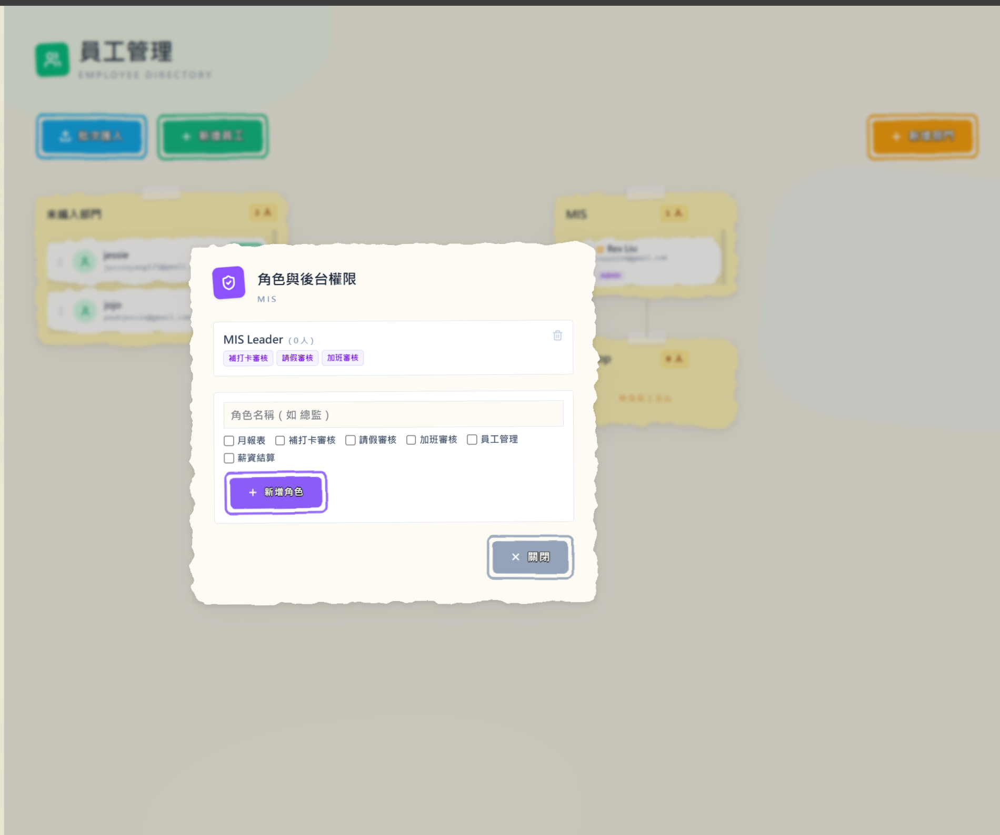
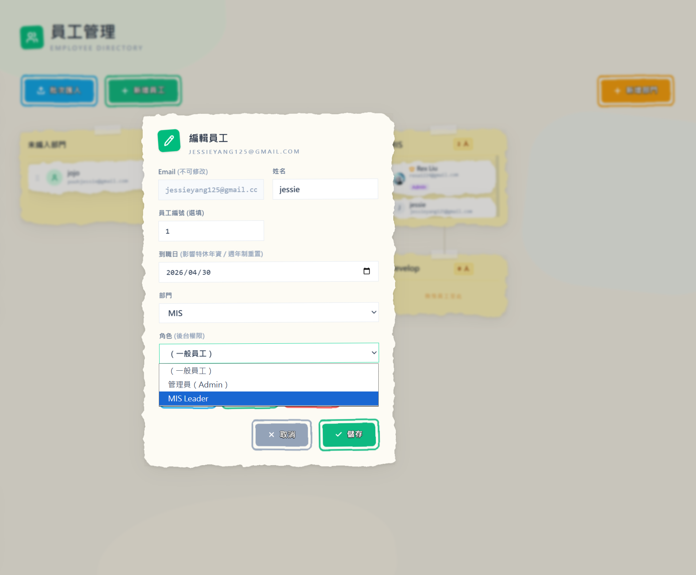

## 公司長大了，老闆別再一個人扛！這次 ClocDot 有了組織圖，還讓主管「分層把關」

是我啦，ClocDot 的產品擔當醬瓜。

還記得上次「把薪水算到實發」那篇嗎？從打卡一路接到員工帳戶，醬瓜自己都覺得很爽。不過有位老闆看完跟我說：「算錢是順了，但我們人變多了，所有請假、補卡、加班還是**全部塞到我一個人**審，我快變成人肉簽核機了。」

這句話戳到痛點。公司一旦長大，問題就從「算得對不對」變成「**誰該管誰、誰能看什麼、誰來簽**」。所以這次 ClocDot 一口氣補上三塊拼圖——**組織圖、分層簽核、後台權限**——讓你把「管理」這件事，從一個人，攤給對的人。來看看新東西～

## 1. 組織圖：把你的公司「畫」出來

打開後台「員工管理」，多了一張**組織圖**。一開始所有人都還在「未編入部門」，等著你把公司的樣子畫出來。

你可以：

- **新增部門**，而且部門能有上層部門——總經理室底下掛業務部、業務部底下再掛業務一課，**整棵樹**長什麼樣，一眼就懂
- 直接用**拖曳**把員工拉進部門裡，調動就像把便利貼換個位置貼，咻一下
- 幫每個部門**指定主管**，只要在部門設定裡選一個人就好

設好之後，整間公司的層級關係就攤在眼前——部門、上下層、主管一目了然，被指定為主管的人，卡片上還會別上一顆小星星，誰是誰一眼認得出來。

**對你的好處**：公司結構不再只活在你腦袋裡或一張過期的 Excel。它變成 ClocDot 看得懂的資料——也因為它看得懂，下面兩件事才有可能發生。

## 2. 簽核不再全擠在老闆身上：沿著組織「往上跑」

有了組織圖，簽核就能照著「線」走。你在「公司設定」裡設一個**簽核層數**，員工送出請假／補卡／加班之後，ClocDot 會自動把單子：

- 先交給**他所屬部門的主管**，主管簽完，再往上交給**上一層部門的主管**，一路往上收集到你設定的層數為止
- **任何一層駁回，整張就退回**，員工重送，乾淨俐落
- 主管不必登入後台也能處理——員工端 App 新增了一頁「**待簽核**」，輪到你簽的單就會出現在那，核准／駁回點一下就好
- 真的趕時間？**老闆（管理員）隨時能越級一鍵核准**，不會被流程卡死

如果某個部門還沒設主管、或樹不夠高，單子會自動回到管理員這邊，不會卡在半空中。

**對你的好處**：審核這件事，終於從「老闆一個人的待辦」變成「該負責的人各簽各的」。你只要管真正需要你拍板的那幾張。

## 3. 讓主管也能進後台，但只開「該看的那幾扇門」

這塊是 ClocDot 最得意的。以前後台是「全有或全無」——不是管理員、就完全進不來。現在不一樣了：

你可以在組織圖裡，為每個部門**自訂角色**，例如「行銷部 總監」「行銷部 副理」。每個角色**勾選能用哪些模組**：月報表、補打卡審核、請假審核、加班審核、員工管理、薪資結算……要開哪幾扇門，你自己決定。

建好的角色會列在部門底下，標上它開了哪幾扇門，一目了然。

接著把角色指派給員工——在員工資料裡選一個角色就好。指派後，他登入後台**只看得到被授權的那幾頁**，其他通通不顯示。「公司設定」「角色管理」這種敏感的，**永遠只有老闆（管理員）能碰**——主管再大也動不了公司的根本設定。

舉個例子：小王是行銷部總監，你給他「請假審核＋加班審核」；小劉是副理，只給「補打卡審核」。兩人登入後台，看到的選單**完全不一樣**，各管各的。

**對你的好處**：你可以放心把「審核」「看報表」這些日常分出去，又不用擔心誰不小心改到薪資設定或公司資料。授權，但不交出鑰匙圈。

## 4. 主管只看「自己團隊」的單，不會偷看到別部門

開了權限，馬上會有人問：「那主管會不會看到**全公司**的請假？」放心，不會。

ClocDot 幫主管的審核**自動框住範圍**——他在請假／補卡／加班審核裡，**只看得到自己部門（含底下子部門）成員的單**，別部門的完全不會出現，想用網址硬翻也翻不到。

至於組織圖，主管**看得到整間公司的樣子**（畢竟知道自己在哪一塊是好事），但**只能看、不能改**：新增部門、編輯、刪除、拖曳調動成員 這些動作，依然只留給管理員。

**對你的好處**：權限放得出去，隱私也守得住。每位主管的視野，剛剛好就是他該負責的那一塊。

## 順手一提：員工批次匯入

對了，這次還偷偷塞了一個小東西——**員工批次匯入**。新公司上線、或一次進來一批新人時，下載範本、填好 Excel（或 CSV）丟上來，ClocDot 會先**預覽**告訴你哪幾筆有問題、哪幾筆可以匯，確認沒錯再一次建立，還會把系統幫每個人產的**初始密碼**整理成一份清單給你發。再也不用一個一個慢慢敲。

---

## 小結

這次更新繞著一個主題：**讓「管理」可以分給對的人。**

- **組織圖** → 把公司結構畫出來，部門、上下層、主管一目了然
- **分層簽核** → 單子沿著組織往上跑，老闆不再是唯一的簽核機
- **角色與後台權限** → 主管也能進後台，但只開該開的模組
- **資料範圍** → 主管只看自己團隊的單，授權也守得住隱私
- **員工批次匯入** → 一批新人，一次到位

從「老闆一個人扛全部」，到「每個主管管好自己那一塊」——公司長大的陣痛，ClocDot 想幫你少痛一點。有任何想法或踩到雷，都歡迎告訴醬瓜，我們會繼續把 ClocDot 磨得更順手。

下次見啦～

