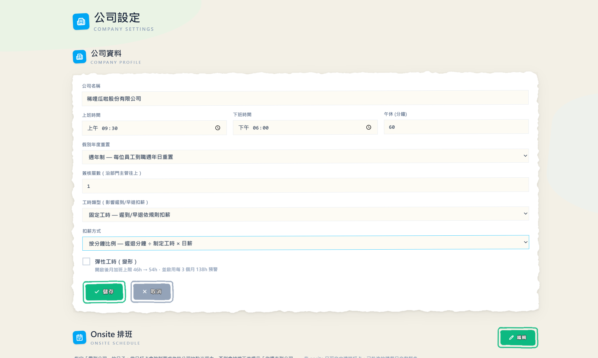

## 遲到早退也會算進薪水了！這次 ClocDot 連「沒做滿的工時」都幫你算清楚

是我啦，ClocDot 的產品擔當醬瓜。

還記得上次「把薪水算到實發」那篇嗎？從打卡一路接到員工帳戶，醬瓜自己都覺得很順。結果有位老闆看完丟了一句：「算是算得很漂亮，但**遲到、早退、缺勤這些**完全沒反映到薪水裡——準時來的跟天天遲到的，月底領一樣多，那我幹嘛要求大家準時？」

這句話又戳到痛點。所以這次 ClocDot 把**「沒做滿的工時」也接進計薪**——遲到、早退、缺勤、請假，全部能照規則折算到薪資裡，而且每間公司可以自己挑要寬還是要嚴。來看看新東西～

## 1. 先選：你的公司是「變形工時」還是「固定工時」？

每間公司對「準時」的要求不一樣，所以 ClocDot 在「公司設定」裡新增了一個**工時類型**開關，預設是**變形工時**：

- **變形工時（寬鬆派）**：不管你幾點到、幾點走，**只要當天做滿制定工時就不扣薪**。適合彈性上下班、看產出的團隊。
- **固定工時（嚴謹派）**：上下班時間是紅線，**遲到、早退會按規則扣薪**。適合輪班、櫃台、產線這種「人要在位子上」的工作。

選了固定工時後，還能再決定**扣薪方式**：

- **按分鐘比例**：遲到 30 分，就扣「30 ÷ 制定工時 × 日薪」，算得剛剛好。
- **按小時進位比例**：遲到 10 分也算 1 小時，想用力一點嚇阻遲到的就選這個。

**對你的好處**：寬鬆還是嚴格，由你一個開關決定，不用為了配合系統去遷就管理風格。

## 2. 缺勤、做不滿工時，ClocDot 會自己折算

設定好之後，月底結薪時 ClocDot 會逐日檢查每個人的出勤：

- **變形工時**：當天做滿就 0 扣；**沒做滿就按差的那幾分鐘**比例扣。
- **固定工時**：照你選的方式，把**遲到＋早退**的分鐘折成扣款。
- **缺勤（該上班卻整天沒打卡、也沒請假）**：直接**扣一整天日薪**。

而且 ClocDot 很克制——**單日最多就扣一天的薪水**，不會因為哪天數字爆掉就扣過頭。

**對你的好處**：準時的人薪水完整、常遲到的人如實反映，公平感自然就出來了，你不用再人工對著出勤表一格一格扣。

## 3. 請假要不要扣、扣多少？每種假自己設

請假比較微妙——特休當然不扣，但事假、病假呢？這題沒有標準答案，所以 ClocDot 把決定權交回給你。

在「假別政策」裡，每一種假別現在都能設一個**扣日薪比例**：

- 預設**事假扣全薪（100%）**、**病假扣半薪（50%）**，其餘假別不扣（0%），開箱就是常見做法。
- 不滿意？直接改。想讓病假也全薪、或事假只扣一半，填個百分比就好。

ClocDot 會把請假時段先從「應出勤」裡扣掉，再依比例算請假扣款——所以**請假的時間不會又被當成缺勤重複扣**，半天假＋上半天班這種情況也算得清清楚楚。

**對你的好處**：公司的請假規則百百種，ClocDot 不替你決定鬆緊，只負責照你設的規則精準執行。

## 4. 月報表多了一欄「缺勤天」，別再讓缺勤隱形

最後一個小而有感的改動。以前的月報表只有出勤、遲到、早退、請假，**缺勤是隱形的**——一個整月沒來的人，每一欄都是 0，你反而看不出他其實缺勤了一整個月。

現在 ClocDot 在月報表（和匯出的 CSV）都加上了**「缺勤天」**欄位，有缺勤就標紅，搭配薪資頁的「未計薪」徽記，整件事就串起來了：缺勤幾天、為什麼薪水這樣算，一目了然。

**對你的好處**：出勤的全貌終於完整，月底核對薪資時不用再猜「這個 0 到底是正常還是有問題」。

---

## 小結

這次更新繞著一個主題：**讓「沒做滿的工時」如實反映到薪水。**

- **工時類型開關** → 變形 or 固定，寬鬆嚴格一鍵決定
- **遲到／早退／缺勤折算** → 按分鐘或進位小時，單日扣好扣滿不過頭
- **假別扣薪比例** → 事假、病假…每種假自己設，預設貼近常見做法
- **月報表缺勤天** → 讓缺勤不再隱形

從「算得對」，到「算得公平」——ClocDot 想讓準時的人被看見、該扣的如實扣，老闆少點為難。一樣，有任何想法或踩到雷，都歡迎告訴醬瓜，我們會繼續把 ClocDot 磨得更順手。

下次見啦～

