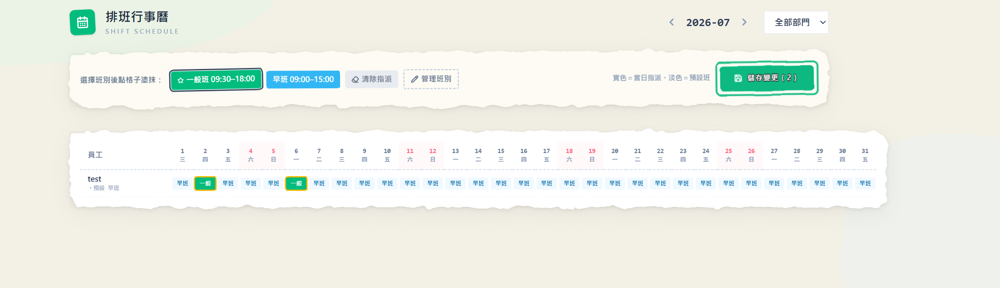
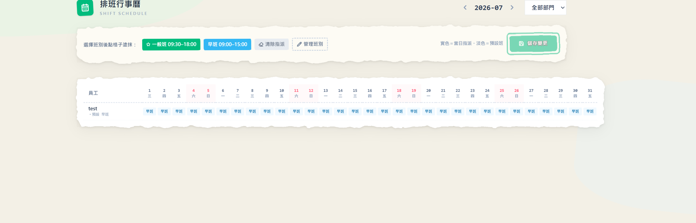
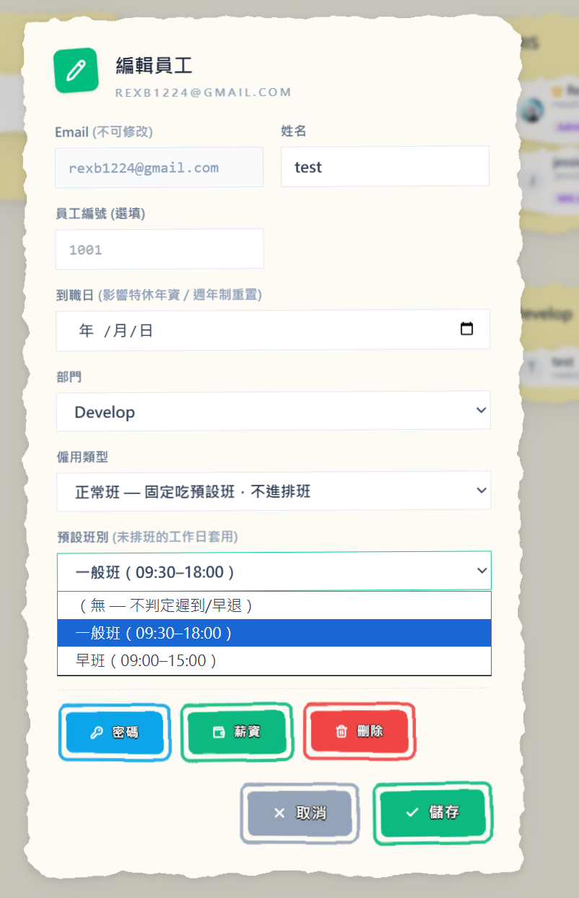

是我啦，ClocDot 的產品擔當醬瓜。

之前 ClocDot 的上下班時間是「全公司一組」——早上九點上班、晚上六點下班，人人一樣。辦公室團隊用起來沒問題，但開店的老闆看完直搖頭：「我的人有早班有晚班，還有只來週末的兼職，你叫我全公司設同一個時間，那遲到是要怎麼算？」

說得對。所以這次 ClocDot 把整套**排班**做出來了——每個人、每一天，都可以有自己的上下班時間。來看看新東西～

## 1. 班別 × 行事曆，用「塗」的排班

排班的邏輯很簡單：先定義**班別**（例如一般班 09:30–18:00、早班 09:00–15:00，各自帶自己的午休時間），然後打開**排班行事曆**——列是員工、欄是日期，選好一個班別，往格子上一點一拖，班就排好了，像拿麥克筆在月曆上塗顏色。

- 每個班別一個顏色，整個月誰上什麼班一眼掃完
- 排錯了？選「清除指派」再塗一次就好
- 改完按一次「儲存變更」，整批送出——按鈕上會直接顯示累積了幾筆修改，不會改到一半斷在那邊

而且班別管理就收在排班頁裡——排班排到一半發現缺一個「大夜班」，點「管理班別」當場建，建完自動變成手上的畫筆，接著塗，**不用離開頁面、排到一半的內容也不會不見**。

**對你的好處**：排一整個月的班，從「開 Excel 慢慢填」變成「幾分鐘塗完」，改班也是點兩下的事。

## 2. 沒排到的日子怎麼辦？有「預設班」接住

不是每間公司天天都在換班。所以每個員工可以設一個**預設班別**：有排班的日子照排班走，**沒排班的日子自動吃預設班**，遲到早退照樣判得準。建班別時勾一下「設為預設班別」就搞定，之後新加入的員工也會自動帶入這個班。

排班行事曆上也看得出誰在吃預設班：**實色格子是當天特別指派的班，淡色格子就是預設班在墊底**，員工名字底下還直接標著他的預設班別。

每個人的預設班在**員工管理**裡設定，下拉選單挑一個班別就好；不想被判遲到早退的人（例如老闆自己），選「無」就好。

原本就在用 ClocDot 的公司完全不用動手——升級時 ClocDot 會把你原本設定的公司上下班時間**自動變成一個「一般班」**，全體員工掛好預設班。升級前後，遲到早退的判定一分鐘都不會差。

**對你的好處**：想用排班的開始排，還不需要的照舊過日子，升級沒有陣痛期。

## 3. 晚班跨過半夜？凌晨下班照樣算對

做餐飲、做客服的都懂這題：晚班 22:00 上班、**翌日凌晨 06:00** 下班，這張下班卡到底算哪一天的？

ClocDot 的答案是：**整段班都算在排班那一天**。凌晨打的下班卡會自動接回前一天的出勤紀錄，工時、遲到、早退全部歸在排班日——這也是勞基法「一個工作日」的認定方式。

- 建班別時結束時間填得比開始時間早，就是跨日班，畫面上會標 **⁺¹**（例如 22:00–06:00⁺¹）
- 凌晨 00:30 才來打上班卡？照樣用排班日的 22:00 判遲到，跑不掉
- 忘了打卡要補「下班 05:30」？ClocDot 知道那是翌日凌晨，不會補成中午前

**對你的好處**：夜班的出勤終於不用人工橋，打卡、補卡、月結薪資全部自動歸對天。

## 4. 員工分三種：正常班、排班制、兼職

不是每個人都需要被排班。這次每位員工多了一個**僱用類型**，就在員工資料裡切換：

- **正常班**：內勤、行政這種天天固定時間的人。固定吃預設班，不會出現在排班行事曆上——排班的畫面留給真正需要排的人。
- **排班制**：門市、輪班人員。逐日排班，班表就是他的上下班依據。
- **兼職**：排班方式跟排班制一樣，但**請假不佔額度**——照樣送單、照樣走簽核讓主管知道，只是不會去扣特休或事假的時數。（兼職的時薪計算 ClocDot 正在做，下次更新見。）

既有員工升級後全部是「正常班」，行為跟以前一模一樣；要把誰改成排班制，員工資料裡切一下就好。

**對你的好處**：辦公室的人不被排班打擾，該排班的人排得清楚，兼職的假單不會吃掉不存在的額度。

## 5. 排班可以放手給主管，員工自己看得到班表

排班通常不是老闆親自排的。所以**「排班」是一個可以授權的權限**——在組織圖幫店長建個角色、勾上排班，他就能進排班行事曆，而且**只能排自己部門的人**，別的部門看都看不到。

排好的班，員工端也看得到：打卡頁會掛一張**今日班別**的小紙片（上班前先確認今天幾點的班），個人頁多了**本週班表**，哪天早班哪天晚班、哪天是主管特別指派的，清清楚楚。

**對你的好處**：排班的權責下放給該負責的人，員工不用再到群組裡問「我明天幾點的班」。

---

## 小結

這次更新繞著一個主題：**讓每個人的工作時間，都能被正確地安排和計算。**

- **班別＋排班行事曆** → 塗抹式排班，幾分鐘排完一個月
- **預設班回退** → 沒排到的日子自動接住，既有公司無痛升級
- **跨日班** → 凌晨下班歸排班日，夜班出勤不再人工橋
- **僱用類型** → 正常班／排班制／兼職，各過各的日子
- **排班授權＋員工班表** → 主管排自己部門的班，員工自己查班表

從「全公司一組時間」到「每個人自己的班表」——ClocDot 想讓輪班的店家也能把出勤管得輕鬆。一樣，有任何想法或踩到雷，都歡迎告訴醬瓜，我們會繼續把 ClocDot 磨得更順手。

下次見啦～
