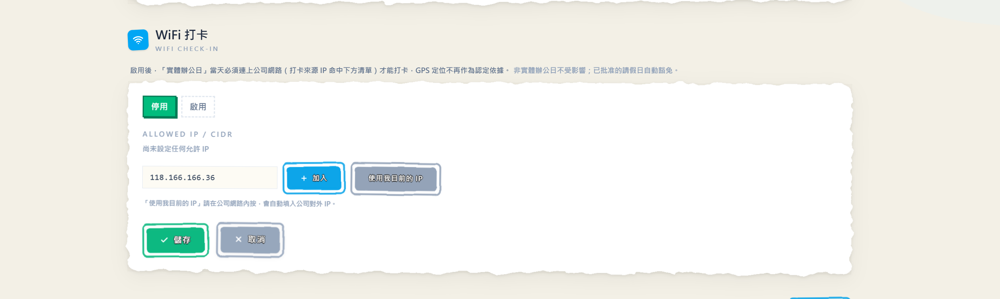

是我啦，ClocDot 的產品擔當醬瓜。

ClocDot 一直有 GPS 打卡——打卡時記座標，標記你是在公司、在外面、還是沒開定位。大部分公司用起來剛剛好，但陸續有老闆跟醬瓜反映：「GPS 會飄，手機也有辦法裝假定位，我就想要一個更硬的判準——**人有沒有真的走進辦公室**。」

想了想，答案其實就在每間辦公室的天花板上：**WiFi**。人進了公司自然會連上公司網路，這件事比座標更難裝出來。所以這次 ClocDot 把 **WiFi 打卡**做出來了——來看看新東西～

## 1. 啟用後，連上公司網路才打得了卡

設定中心多了一個 **WiFi 打卡**開關。打開之後，在「實體辦公日」當天，員工必須連上公司網路才能打卡——打卡的當下，ClocDot 會在伺服器端檢查這張卡是不是從你公司的網路出口送出來的。不是？擋下，畫面上直接告訴他：

> 「不在辦公區域無法打卡」

而且啟用 WiFi 打卡後，實體辦公日的認定**只看網路、不再看 GPS**——座標照樣記錄下來當參考，但人坐在公司樓下馬路邊、GPS 顯示「在範圍內」也沒用，網路不對就是不行。要嚴，就嚴得徹底。

**對你的好處**：「到公司」從「座標大概在附近」升級成「人真的連上了公司網路」，想動手腳的空間小了一大截。

## 2. 員工什麼都不用做，手機也不用裝東西

醬瓜知道你在想什麼：「該不會要員工裝 App、開什麼權限吧？」

不用。WiFi 打卡的驗證**全部發生在伺服器端**——員工打開 ClocDot 照常按打卡，系統看的是這個請求從哪個網路來的。連上公司 WiFi，自然就過；沒連上，自然就擋。員工端完全無感，連定位權限都可以不用開（反正這天不看 GPS 了）。

**對你的好處**：不用教學、不用宣導、不用挨家挨戶幫員工設定手機，開了開關就生效。

## 3. 設定超簡單：按一下「使用我目前的 IP」

要讓 ClocDot 認得你公司的網路，得告訴它公司的對外 IP。聽起來很工程師？放心，設定中心的 **WiFi 打卡**面板長這樣——就一個停用／啟用切換，加一張允許 IP 清單：

- 人在公司，按 **「使用我目前的 IP」**——ClocDot 自動把你公司現在的對外 IP 填進輸入框，完全不用去查（記得要在公司網路內按，它抓的就是「你現在」的出口 IP）
- 也可以自己輸入 IP 按**「加入」**；公司網路不只一條？清單可以加**好幾筆**，總部一筆、分店一筆
- 懂網路的老闆也可以直接填 **CIDR 網段**（例如 61.220.33.0/24），整段一次涵蓋
- 清單填好按**「儲存」**，再把開關切到**「啟用」**，當天就生效

另外有個貼心的防呆：**清單是空的就不給你開啟用**——不然開關一按，全公司從此誰都打不了卡，那畫面太美醬瓜不敢看。

**對你的好處**：設定一分鐘搞定，而且 ClocDot 不會讓你把自己鎖在門外。

## 4. 該嚴的日子嚴，該彈性的日子照舊

WiFi 打卡不是「一開就全面戒嚴」。它只管**實體辦公日**：

- **實體辦公日**：必須連公司網路才能打卡
- **非實體辦公日**：遠端照打、在家照打，跟以前一模一樣
- **已批准請假的日子**：自動豁免，不會叫請假的人連公司 WiFi
- **沒開這個設定的公司**：什麼都沒變，原本的 GPS 打卡繼續用

這跟 ClocDot 一貫的想法一樣——不是「一律放水」也不是「一律死擋」，而是把嚴格用在你指定要嚴格的日子。

**對你的好處**：混合辦公的節奏不被打亂，只有「說好要進公司的那天」才驗網路。

## 5. 每張卡都記下「從哪個網路打的」

順手做的一個升級：從這版開始，**每一張打卡（上班、下班）都會記錄來源 IP**——不管你有沒有開 WiFi 打卡。

平常你不會用到它，但哪天出勤有爭議（「他那天到底有沒有來？」），HR 多一份可以攤開來看的紀錄：這張卡是從公司網路打的，還是從外面打的，清清楚楚。

**對你的好處**：出勤紀錄多一個維度，爭議發生時有憑有據。

---

## 小結

這次更新繞著一個主題：**把「人到底在不在公司」這件事，驗得更實。**

- **WiFi 打卡開關** → 實體辦公日必須連上公司網路才能打卡
- **伺服器端驗證** → 員工零設定、手機零安裝，比 GPS 更難造假
- **一鍵抓 IP ＋ 防鎖死** → 設定一分鐘，不怕把全公司鎖在門外
- **只管實體辦公日** → 遠端日照舊、請假自動豁免、沒開設定完全不變
- **打卡記錄來源 IP** → 每張卡多一份稽核依據

GPS 回答「人大概在哪」，WiFi 回答「人是不是真的進來了」——兩個都在，你挑合適的用。一樣，有任何想法或踩到雷，都歡迎告訴醬瓜，我們會繼續把 ClocDot 磨得更順手。

下次見啦～
